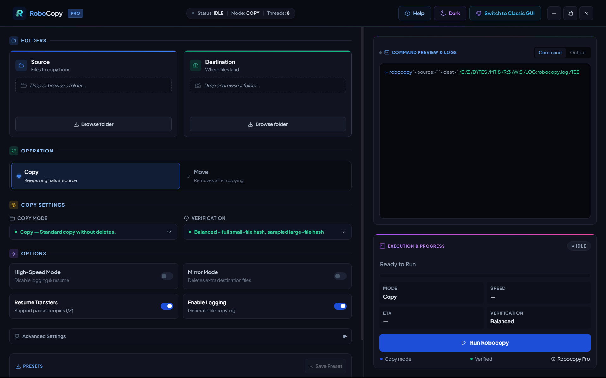
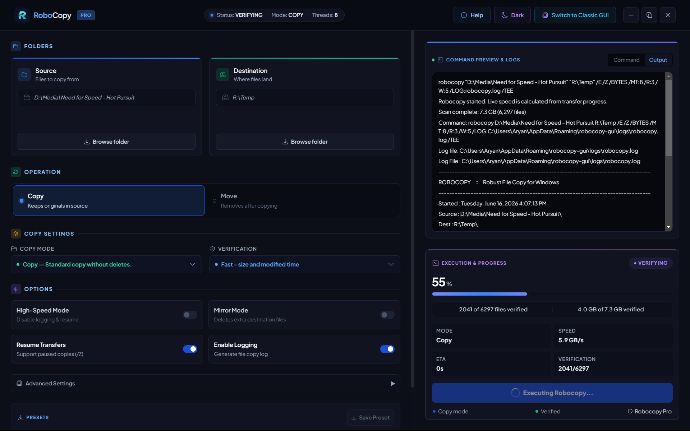
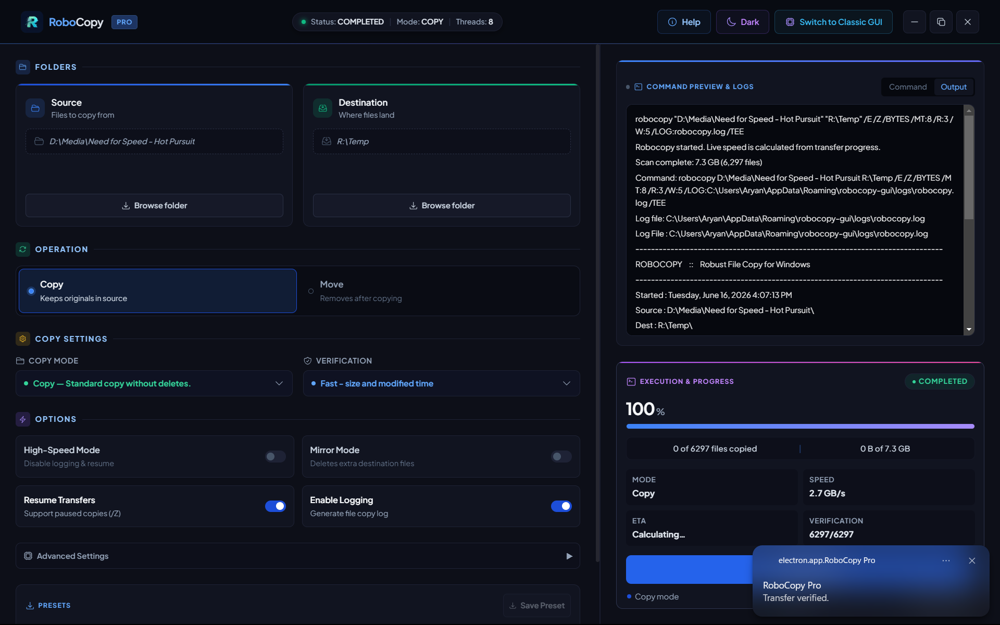

<h1 align="center">🚀 RoboCopy Pro</h1>

<p align="center">
  A modern, glassmorphism GUI for Windows Robocopy  
  <br/>
  <b>Fast. Safe. Beautiful.</b>
</p>

<p align="center">
  
  
  
  
</p>

<p align="center">
  <a href="https://github.com/ArYaN-X404/RoboCopy_GUI/releases/latest">
  
</a>
  <a href="#"></a>
  <a href="#"></a>
</p>

---

## 🎬 Demo

<div align="center">
  
</div>

---

## 🖼 Screenshots

<div align="center">

### 🧩 Setup Interface


---

### ⚡ Running Transfer (Live)


---

### ✅ Completed Transfer


</div>

---

## ✨ Features

### ⚡ Performance
- Non-blocking architecture (no UI freezes during heavy transfers)
- Multi-threaded copying (`/MT:n`) for maximum speed
- Efficient handling of large-scale file operations

### 🎯 User Experience
- Massive drag-and-drop zones for Source & Destination
- Clean glassmorphism UI with modern design principles
- One-click presets for recurring workflows

### 📊 Monitoring & Feedback
- Real-time Robocopy output parsing
- Live progress bars with ETA calculation
- Syntax-highlighted logs for better readability

### 🖥 Native Integration
- Windows taskbar progress indicators
- Native toast notifications on completion
- Context menu integration (Explorer right-click)

### 🧠 Advanced Controls
- Restartable mode (`/Z`) for unstable transfers
- Mirror mode (`/MIR`) for full directory sync
- Custom retry logic (`/R:n /W:n`)
- File & directory exclusions (`/XD /XF`)

---


## 📖 Quick Usage Guide

1. Drag & drop folders into **Source** and **Destination**  
2. Choose transfer mode (Copy / Move)  
3. Configure options:  
   - **Mirror (`/MIR`)** – Sync directories *(⚠️ deletes extra files)*  
   - **Resume (`/Z`)** – Restartable transfers  
   - **Threads (`/MT:n`)** – Speed optimization  
   - **Retries (`/R:n /W:n`)** – Error handling  
4. Click **Run Robocopy**  
5. Monitor progress in real-time  

---

## 💡 Why RoboCopy Pro?

Robocopy is incredibly powerful — but not user-friendly.

RoboCopy Pro was built to:
- Eliminate command-line complexity
- Reduce risk of destructive mistakes
- Provide a visual, intuitive workflow
- Bring a modern UI to a legacy tool

---


## 🧑‍💻 Who is this for?

- Users who want a simple GUI for Robocopy  
- People who prefer drag-and-drop over command line  
- Anyone needing fast, reliable file transfers on Windows  

---

## ❓ What is Robocopy?

Robocopy (Robust File Copy) is a built-in Windows utility for high-performance file copying and directory synchronization.

It is extremely powerful — but difficult to use via command line.  
RoboCopy Pro simplifies it into a modern visual experience.

---

## ⚙️ Design Decisions

- Robocopy runs as a **child process** to prevent UI blocking  
- Output is **parsed in real-time** to display logs and progress  
- UI remains responsive even during **large file transfers**  
- Separation between **Electron main process** and **React renderer** ensures stability  

---

## 📁 Project Structure

```
src/
 ├── components/      # UI components
 ├── pages/           # Main screens
 ├── utils/           # Helper functions
 ├── electron/        # Electron main process
```

---

## 📈 Impact

- Simplifies complex Robocopy commands into a visual workflow  
- Reduces risk of destructive mistakes (like incorrect flags)  
- Improves productivity for file operations and backups  

---

## 📚 Learnings

- Electron process architecture (main vs renderer)  
- Handling system-level commands using Node.js  
- Real-time parsing of CLI output  
- Designing UI for technical tools  


## 🏗 Architecture

```
React UI (Renderer)
        ↓
Electron (Main Process)
        ↓
Node.js Child Process
        ↓
Windows Robocopy Engine
```

- UI runs independently from heavy file operations  
- Ensures zero freezing even during multi-GB transfers  

---

## 🛠 Tech Stack

| Layer | Technology |
|------|-----------|
| Frontend | React + Vite |
| Styling | Tailwind CSS (Glassmorphism UI) |
| Desktop Shell | Electron |
| Backend | Node.js (child_process) |

---

## 🚀 Getting Started

### 📋 Prerequisites
- Windows 10 / 11  
- Node.js 18+ (20+ recommended)  

---

### 💻 Local Development

```bash
npm install
npm run dev
```

---

## 📦 Build & Package

To create a standalone executable:

```bash
npm run build
npm run dist
```

### ⚙️ Build Outputs

| Command | Output |
|--------|--------|
| `npm run dist:portable` | Portable `.exe` (no installation required) |
| `npm run dist:installer` | Installer `.exe` (NSIS setup) |

---

## 🖱 Windows Context Menu Integration

The installer automatically adds a context menu option.

👉 Right-click any folder → **"Transfer with RoboCopy Pro"**

- Instantly opens the app  
- Auto-fills the selected folder as Source  

---


## 🗺 Roadmap

- [ ] Recent paths history dropdown  
- [ ] SHA-256 file verification  
- [ ] Advanced preset management  
- [ ] Persistent logging system  
- [ ] Improved error handling  
- [ ] Automated testing  
- [ ] Performance optimizations  
- [ ] Transfer analytics dashboard  

---


## ⚠️ Disclaimer

Robocopy is a powerful system utility.

⚠️ Features like **Mirror Mode (`/MIR`) are destructive**  
They will delete files in the destination to match the source.

👉 Always double-check before running critical operations.

---

## 🤝 Contributing

Contributions are welcome!

If you have ideas, improvements, or bug fixes:
- Open an issue  
- Submit a pull request  

---

## ⭐ Support

If you find this project useful, consider giving it a **star ⭐**  
It helps the project grow and reach more developers!

---

## 👨‍💻 Author

**Aryan Patel**

---

## 🔍 Keywords

robocopy gui, file transfer tool windows, robocopy wrapper, electron desktop app, file copy manager

## 📄 License

This project is licensed under the **MIT License**


